# Sistema de Gestión de Servicios de Clínica

## Integrantes
1. Bermeo Cevallos Jorge Alejandro.
2. Caceres Medina Bolivar Santiago.
3. Chalen Ochoa Shuska Akyra.
4. Gonzalez Rodríguez Scarlet Anabella.
5. Rivera Valdiviezo Ashley Daniela.
6. Silva Parrales Jipson Alexander.

# Sistema de Gestión de Servicios Médicos

## Descripción

Este proyecto consiste en el desarrollo de un Sistema de Gestión de Servicios Médicos, realizado como proyecto del Segundo Parcial de la asignatura Programación Orientada a Objetos.

La aplicación fue desarrollada utilizando Python, PySide6 para la interfaz gráfica y SQL Server como sistema gestor de base de datos.

El sistema permite administrar la información de los pacientes y los servicios médicos ofrecidos por la clínica mediante operaciones CRUD (Crear, Consultar, Actualizar y Eliminar).

---

## Objetivos

- Registrar servicios médicos.
- Registrar información de los pacientes.
- Consultar los registros almacenados.
- Actualizar información existente.
- Eliminar registros.
- Validar los datos ingresados por el usuario.
- Almacenar la información en SQL Server.

---

## Tecnologías utilizadas

- Python 3
- PySide6
- Qt Designer
- SQL Server
- PyCharm
- ODBC Driver 17 for SQL Server

---

## Base de datos

Nombre de la Base de Datos:

```
ClinicaMedica
```

Tabla utilizada:

```
Registros
```

Campos:

- Codigo
- Nombre_Servicio
- Costo_Base
- Nombre
- Apellido
- Cedula
- Email

---

## Funcionalidades

El sistema permite:

- Registrar servicios médicos.
- Mostrar registros almacenados.
- Actualizar información.
- Eliminar registros.
- Seleccionar servicios mediante ComboBox.
- Mostrar automáticamente el costo del servicio.
- Validar correo electrónico.
- Validar longitud de la cédula.
- Validar campos obligatorios.
- Mostrar mensajes de confirmación y error.

---

## Validaciones implementadas

- No permite registrar campos vacíos.
- La cédula debe contener 10 dígitos.
- El correo debe tener un formato válido.
- El costo del servicio no puede ser negativo.
- El costo se genera automáticamente según el servicio seleccionado.

---

## Capturas de funcionamiento

### Interfaz Principal
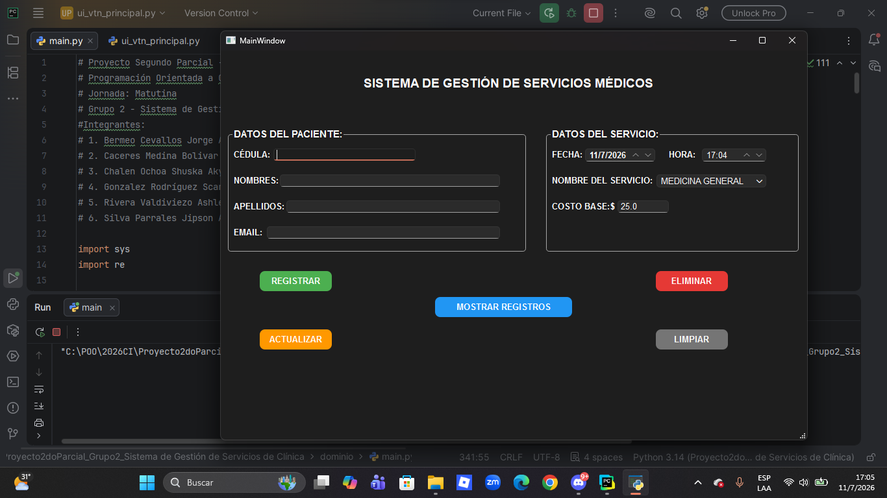
### Registro de datos
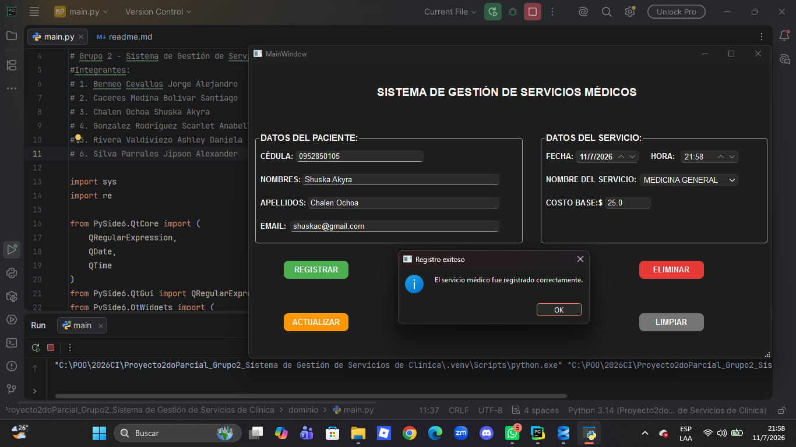
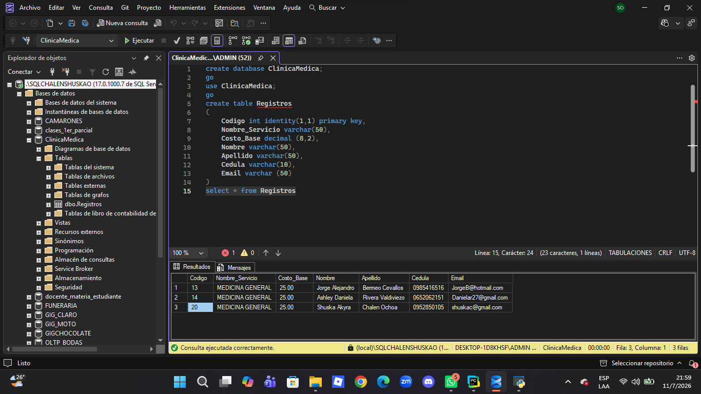

### Actualización de registros
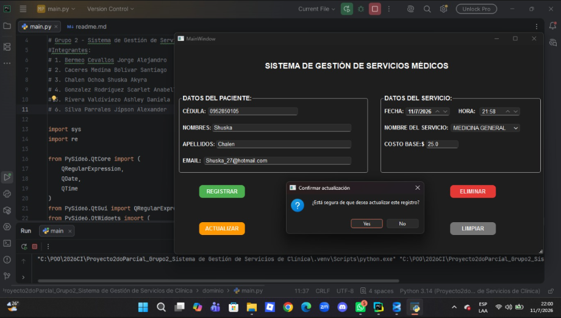
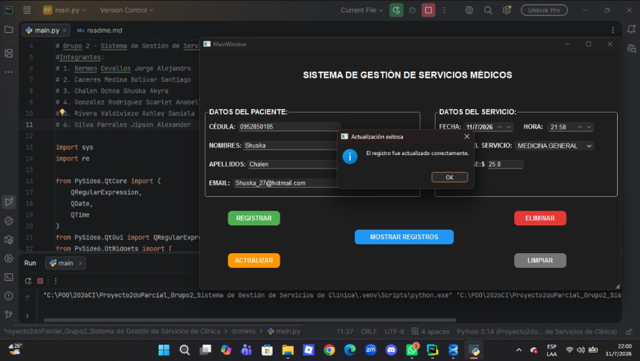
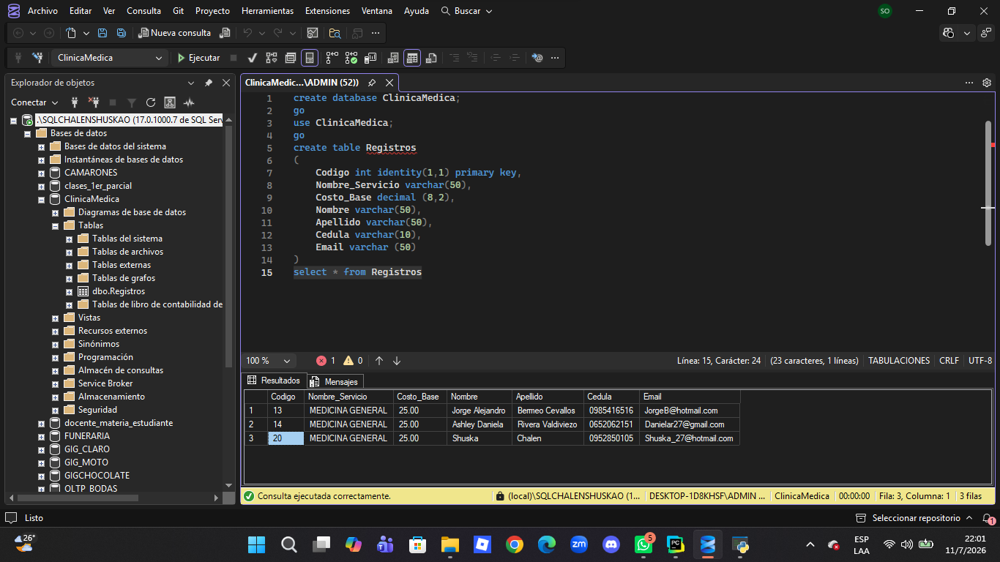

### Demostración de los registros
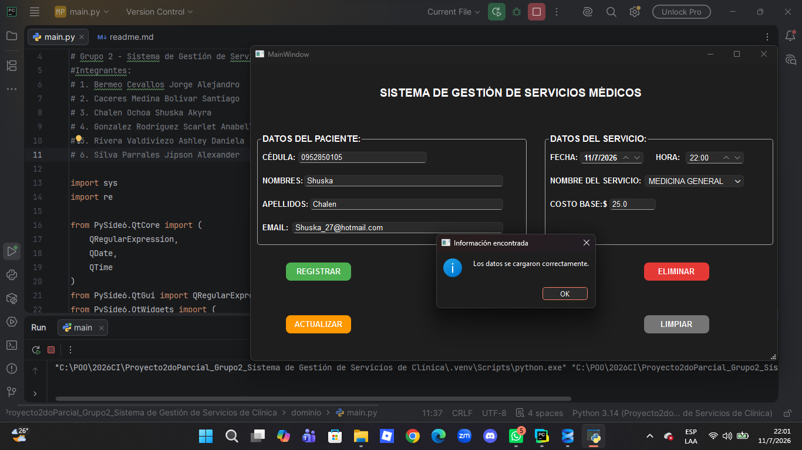

### Eliminación de registros
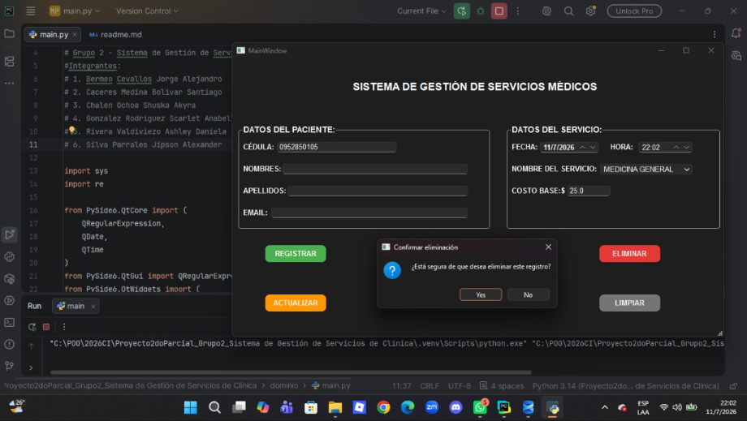
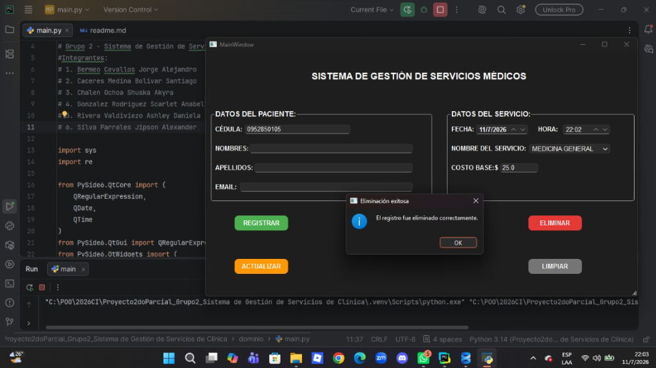
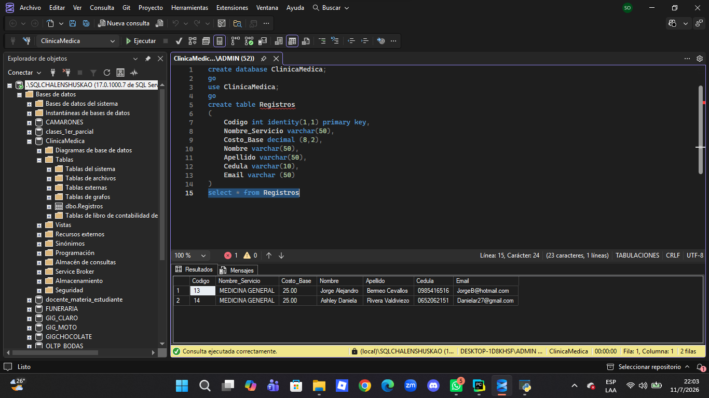

### Base de Datos
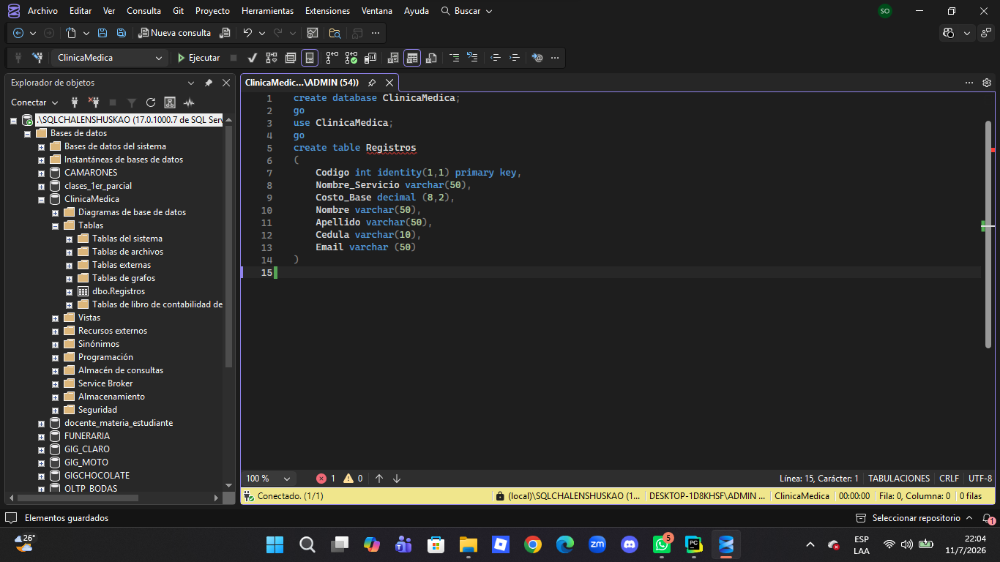

---

## Video de funcionamiento

Enlace: https://drive.google.com/file/d/1X65u1umGpMlR7ZHYY4eTsH3cq3oNQ_pX/view?usp=sharing

---
### Evidencia del Zoom
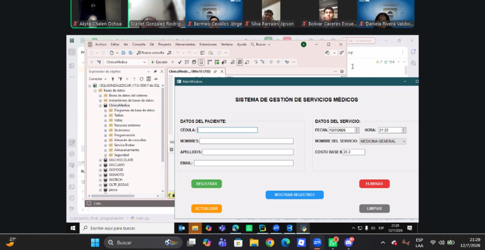
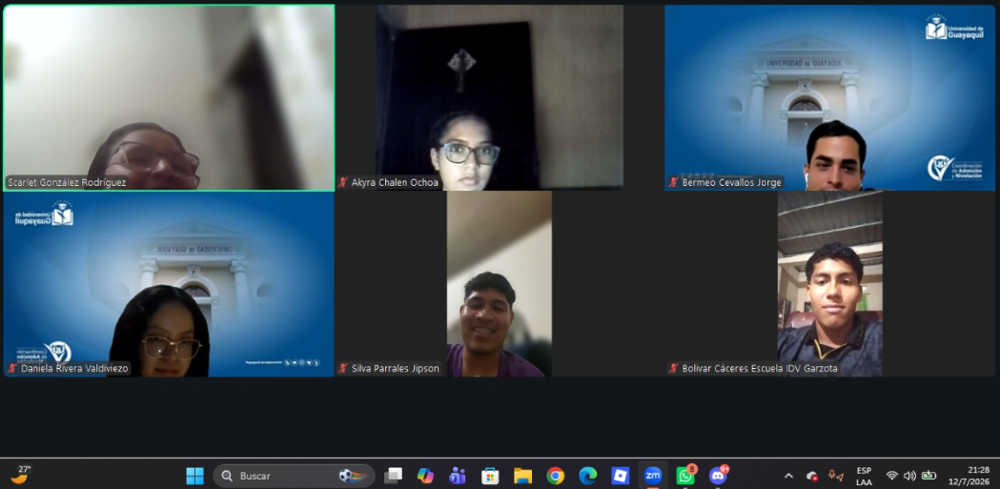